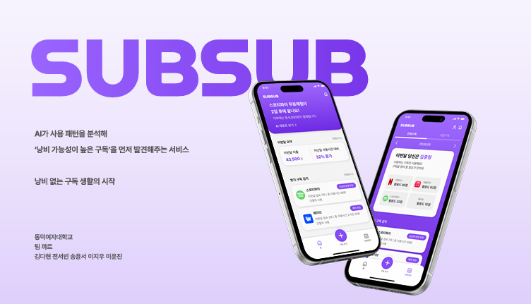
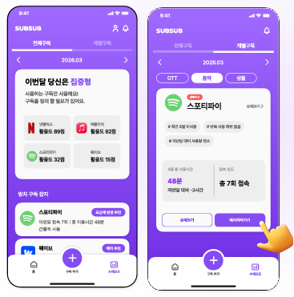
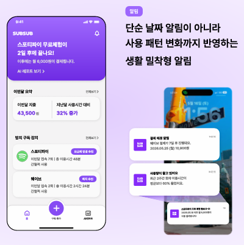
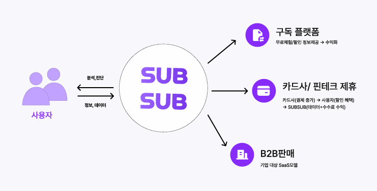

# 📱 SUBSUB (섭섭)
> **AI 기반 구독 소비 최적화 서비스**
> 멋쟁이사자처럼 14기 아이디어톤 본선 진출작 

 

  

---

##  Overview
**SUBSUB**은 사용자 행동 데이터를 기반으로 낭비되는 구독 서비스를 탐지하고 최적의 소비 방안을 제안하는 AI 서비스입니다. 결제 내역 중심의 단순 관리를 넘어, **실제 '사용 데이터'에 기반한 똑똑한 구독 관리**를 지향합니다.

---

##  Problem & Opportunity
현재 구독 경제 시장은 급성장하고 있지만, 소비자들은 여전히 불필요한 지출을 반복하고 있습니다.

*  **66.2%**의 사용자가 **사용하지 않는 구독을 그대로 유지**한 경험이 있습니다.
*  **76.9%**의 사용자가 **무료 체험 후 원치 않는 자동 결제**를 겪었습니다.
*  **핵심 문제:** 기존 서비스들은 결제일만 알려줄 뿐, **"내가 이 서비스를 돈만큼 잘 쓰고 있는가?"**에 대한 사용 기반 판단을 제공하지 못합니다.

---

##  Solution
SUBSUB은 사용자의 실제 서비스 이용 패턴을 분석하여 이 문제를 해결합니다.

* **사용 패턴 기반 구독 분석:** 실질적인 이용 시간과 가치를 정량화합니다.
* **방치 구독 자동 감지:** 결제만 되고 쓰지 않는 '유령 구독'을 찾아냅니다.
* **해지 및 요금제 변경 추천:** 개인 맞춤형 리포트를 통해 합리적인 대안을 제시합니다.

---

##  Key Features

### 1. AI 구독 레포트
 

  

 

* **사용 패턴 분석:** 서비스별 사용 시간, 빈도, 이용 간격 정밀 분석
* **구독 유형 분류:** 카테고리별 소비 성향 파악
* **개인화 추천:** 데이터 기반의 맞춤형 유지/해지 가이드라인 제공

### 2. 통합 알림 시스템
 

  

 

* **결제일 사전 알림:** 다가오는 정기 결제일 리마인드
* **무료체험 종료 알림:** 자동 결제 전환 전 해지 타이밍 알림
* **사용량 감소 감지:** 최근 이용률이 급감한 서비스에 대한 경고 알림

---

## Service Flow
SUBSUB은 사용자 행동 데이터를 수집·분석하여 구독 플랫폼 및 외부 파트너와 유기적으로 연결됩니다.

 

  

 

---

##  AI Architecture
'사용 데이터 기반 의사결정'을 구현하기 위한 핵심 AI 모델링 구조입니다.

* **`K-Means` (사용자 패턴 군집화)**
  * 유저들의 이용 행태를 그룹화하여 세분화된 행동 특성 파악
* **`Isolation Forest` (방치 구독 탐지)**
  * 평소 이용 패턴에서 벗어나거나 급격히 사용량이 줄어든 이상치(Anomaly)를 감지하여 방치된 구독 판별
* **`Recommendation System` (유지 / 해지 / 변경 추천)**
  * 분석된 데이터를 바탕으로 유저에게 최적의 구독 상태(유지, 다운그레이드, 해지 등) 제안

---

##  Tech Stack

### Tools
 Git · GitHub · VS Code

### Development

---

##  Outcome & Resources
* **멋쟁이사자처럼 14기 아이디어톤 본선 진출** 
* 데이터 기반 서비스 기획 및 AI 알고리즘 파이프라인 설계 완료
*  **발표 자료:** [`/assets/subsub_pitch.pdf`](./assets/subsub_pitch.pdf)

---

  <b>SUBSUB은 구독 경제 시대에서 불필요한 소비를 줄이고, 더 합리적인 소비 문화를 만드는 것을 목표로 합니다.</b>

